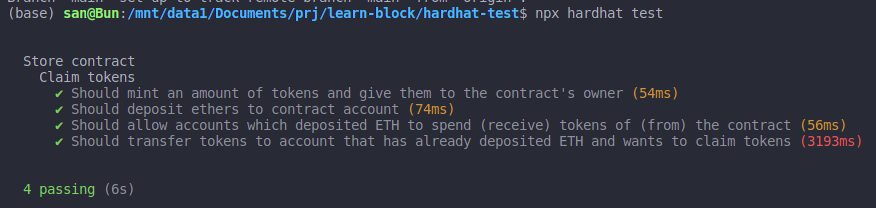

# hardhat-test

- This repo focuses on writing some tests (`test/Store.js`) for functions of a smart contract.
- Contract source code is from https://github.com/volhfx07132/Storate (with some minor modifications in `Store.sol`).

Keyword: ERC20, Token contract, Hardhat, local Hardhat Network.
